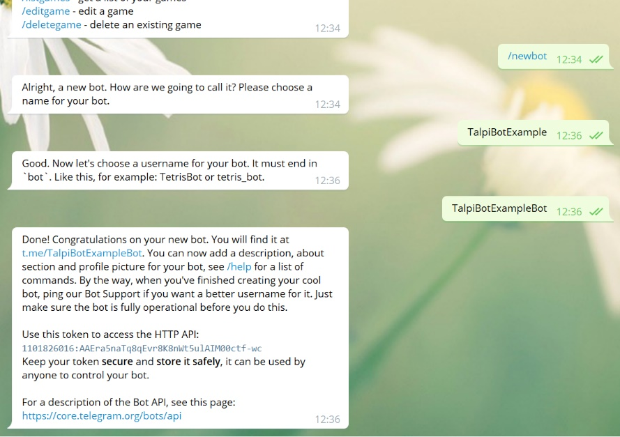
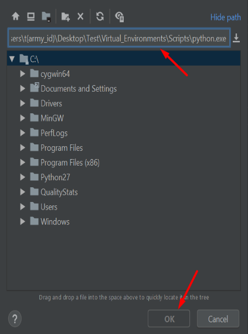

<div dir="rtl" align="right">

בדף זה תמצאו מדריך לכתיבת הבוט הראשון שלכם בטלגרם.

יכול להיות שיש לכם כבר חלק מההורדות או מהמשתמשים שמופיעים כאן, במקרה כזה אפשר לדלג עליהם. המדריך מתאים למחשבי Windows, עם תוכנת PyCharm עליה.

[[_TOC_]]

</div>

<h2 dir="rtl" align="right"> הצטרפות ל-Gitlab </h2>

<div dir="rtl" align="right">

כדי לעבוד עם הבוט צריך להצטרף ל-git repository של TalpiBot. ניתן לעשות זאת באמצעות השלבים הבאים:

**חשוב מאוד להיכנס ל-Gitlab דרך משתמש Gitlab ולא דרך משתמש האימייל שלכם**

1. צרו משתמש Gitlab [כאן](https://gitlab.com/users/sign_up)
2. מלאו את הפרטים שלכם ואשרו את החשבון דרך האימייל שיישלח אליכם
3. עדכנו את צוות הבוט אחרי שסיימתם את השלבים, וחכו לאישור מהם לפני שאתם ממשיכים לשלב הבא (מטרת האישור היא לבדוק שקיבלתם הרשאות לגיט).

</div>

<h2 dir="rtl" align="right"> יצירת הבוט הראשון </h2>

<div dir="rtl" align="right">

1. תיכנסו ל-Telegram בדרך שהכי נוחה לכם (אנחנו ממליצים על [Telegram Desktop](https://desktop.telegram.org/) או [Telegram Web](https://web.telegram.org/))
2. בחיפוש כתבו `BotFather` ותיכנסו לצ'אט הראשון
3. לחצו על הפקודה `start/` שמופיעה בתחתית הצא'ט
4. לאחר מכן שלחו הודעה עם הפקודה `newbot/` ובחרו שם ושם משתמש לבוט שלכם (שימו לב ששם המשתמש חייב להגמר ב-`bot`)
5. כעת תישלח אליכם הודעה דומה לתמונה שמופיעה למטה. תדאגו להעתיק את הטקסט שמופיע אצלכם ישר אחרי המילים HTTP API (אצלכם הוא יהיה שונה, לא להיבהל).
זהו ה-token שלכם, תצטרכו אותו בהמשך המדריך.
6. ברכות, סיימתם!



</div>

<h2 dir="rtl" align="right"> הורדת ה-API שלנו </h2>

<div dir="rtl" align="right">

1. הורידו את קובץ ה-bat של ההתקנה [מכאן](https://gitlab.com/avichayrad.39.talpiot/TalpiBot/-/blob/master/GettingStarted/install_talpitbot_dev_kit.bat) (כפתור ההורדה נמצא מימין למעלה). אם הדפדפן שואל אתכם אם אתם בטוחים שאתם רוצים להוריד את הקובץ, אתם בטוחים.
2. כנסו לתיקייה שהקובץ נמצא בה.
3. העתיקו את הקובץ ל-Desktop שלכם.
3. הריצו אותו כ-admin (קליק ימני > run as administrator). Windows עלול לצעוק עליכם אבל תאשרו בכל זאת.
4. אם מופיע לכם מסך כחול, לחצו על more info ואז על run anyway.
5. במידה והסקריפט מבקש מכם לעדכן את פייתון או להוריד גיט, עשו זאת עכשיו (יש מדריך להתקנות האלה בהמשך העמוד).
6. כעת הסקריפט יבקש מכם להכניס את שם הפיצ'ר שלכם,                                               הכניסו
 `<feature>_<your_name>`, לאחר מכן הוא יבקש מכם את ה-token. העתיקו את ה-token שקיבלתם מ-`BotFather` (טיפ: בשביל להדביק לתוך ה-cmd לחצו על מקש ימני).
7. כעת הסקריפט רץ ומוריד לכם את כל הדברים (לא לפחד מהמסך השחור שמופיע). באמצע הוא נראה כאילו הוא נתקע לפעמים – לא לדגאוג, כשהוא יסיים הוא יודיע לכם על זה (עשויי לקחת כמה דקות).

</div>

<h2 dir="rtl" align="right"> הורדות השלמה </h2>

<div dir="rtl" align="right">
חלק זה רלוונטי אם הסקריפט שהרצתם ביקש מכם להתקין Python או Git.
</div>

<h3 dir="rtl" align="right"> עדכון גרסת Python </h3>

<div dir="rtl" align="right">

1. היכנסו ל[אתר ההורדות של פייתון](https://www.python.org/downloads/release/python-380/)
2. גללו למטה עד שאתם מגיעים לטבלה עם כותרת Files.
3. לחצו על `Windows x86-64 executable installer`.
4. פתחו את הקובץ שהורדתם ולחצו על `Install Now`.

</div>

<h3 dir="rtl" align="right"> הורדת Git </h3>

<div dir="rtl" align="right">

1. הורידו מ[האתר של גיט](https://git-scm.com/download/win)

2. אם ההורדה לא התחילה אוטומטית בחרו באפשרות הראשונה (`64-bit Git for Windows Setup`)

3. פתחו את הקובץ שירד ולחצו על `Install Now` ועל `Next` עד שזה יסיים את ההתקנה

</div>


<h2 dir="rtl" align="right"> קונפיגורציה ל-PyCharm </h2>

<div dir="rtl" align="right">

1. נוצרה לכם תיקייה בשם TalpiBot בשולחן העבודה שלכם,  פתחו אותה כפרוייקט בתוך PyCharm. כנסו לPyCharm, לאחר מכן File > Open (או ישר open) ואז העתיקו את הכתובת הבאה `C:\Users\t<army_id>\Desktop\TalpiBot` לשורת חיפוש (לא לשכוח לשנות למספר האישי שלכם, וגם למחוק את הסוגריים...) ואז לחצו This Window או ok, במידה ואתם לא על מחשב מתלם שנו את ה-path עד לDesktop בהתאם.
2. כעת, היכנסו להגדרות (Ctrl+Alt+s) וחפשו בשורת חיפוש Project Interpreter ולחצו אנטר.
3. לחצו על גלגל השיניים בצד ימין למעלה ואחריו על add.
 
4. כעת לחצו על Existing environment ואז על השלוש נקודות שמופיעות מתחתיו בצד ימין.

5. רשמו `C:\Users\t<army_id>\Desktop\TalpiBot\Virtual_Environments\Scripts\python.exe` בשורת חיפוש (לא לשכוח לשנות למספר האישי שלכם, למחוק גם את הסוגריים...), ולחצו ok, במידה ואתם לא על מחשב מתלם שנו את ה-path עד לDesktop בהתאם. שימו לב שלא בטעות הכנסתם רווח בתחילת השורה (קרה למספר אנשים).

7. כעת לחצו שוב ok ואז apply.
8. זהו! סיימתם את כל ההתקנות הראשוניות, ברכות. כעת נתחיל לכתוב את הפיצ'ר הראשון שלכם.

</div>

<h2 dir="rtl" align="right"> הפיצ'ר הראשון </h2>

<div dir="rtl" align="right">

כעת נכתוב את הפיצ'ר הראשון שלנו - המשתמש מכניס טקסט כלשהו לבוט, ולאחר מכן הבוט שולח את אותה הודעה למשתמש.
1. הכנסו לקובץ `Features/<feature>-<your_name>/UI/<feature>-<your_name>`.
2. תחילה, שנו את השם של המחלקה ל-`<feature>-<your_name>`.
3. כעת נכתוב את הלוגיקה עצמה, בתוך פונקציית ה-main נרשום:
</div>

```python
self.ui.create_text_view(session, "איזו הודעה לשלוח?").draw()
self.ui.get_text(session, self.send_text_back_to_usr)
```

<div dir="rtl" align="right">

אתם לא צריכים להבין מה זה `session` - הוא תמיד יופיע בכל פונקציה שאנחנו מספקים לכם.

הארגומנט `send_text_back_to_usr` הוא הפונקציה שתיקרא אחרי שנקבל קלט מהמשתמש, והיא תקבל כקלט את התגובה של המשתמש כ-`str`)

4. כעת ניצור את הפונקציה ש-`get_text` קוראת לה. החתימה שלה תהיה

</div>

```python
def send_text_back_to_usr (self, session, usr_string)
```

<div dir="rtl" align="right">

מאיפה הגיע המשתנה השלישי? הפונקציה `get_text` תיקרא לפונקציה הזאת, כאשר `usr_string` זה הטקסט שהמשתמש שלח.

5. כעת כל שנשאר לנו זה לגרום לפונקציה לשלוח טקסט שוב עם הערך שהיא קיבלה מהמשתמש. גוף הפונקצייה:
</div>

```python
self.ui.create_text_view(session, usr_string).draw()
```

<div dir="rtl" align="right">

סיימנו לכתוב! נשאר רק להריץ.

6. פתחו את הקובץ Main/main והריצו אותו ב-PyCharm (יכול להיות שלאורך הריצה יופיעו לכם הודעות באדום, זה בסדר, כל עוד הקוד לא קורס זה עובד.)
7. בטלגרם, היכנסו לשיחה עם הבוט שלכם (השם שלו זה השם שבחרתם באחד החלקים הקודמים), שלחו "list/" ואז לחצו על האופציה הראשונה.
8. זהו!!! מזל טוב, למה זה עובד? ה-token שהכנסתם בהתחלה (זוכרים אותו?) גורם לכך שהבוט הזה ספציפית יתנהג לפי הקוד פייתון שאתם רשמתם. 
9. מוזמנים לעיין ב[מדריך](https://gitlab.com/avichayrad.39.talpiot/TalpiBot/-/wikis/home) שמסביר על כל היכולות של הבוט.


</div>
