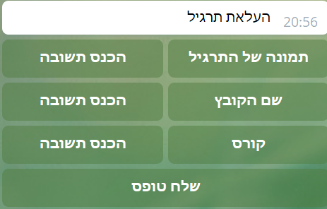
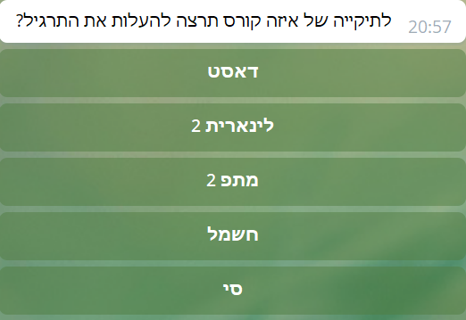
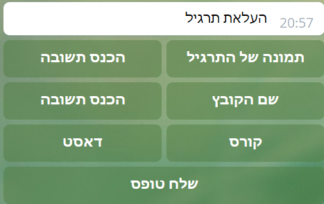

כאן תמצאו פעולות מתקדמות ביכולת התקשורת של הפיצ'ר שלכם עם הבוט.

<div dir="rtl" align="right">

[[_TOC_]]

</div>


## שליחת לוח שנה

יצירת view של לוח שנה (בחירת תאריך) ואז הציור שלה תתבצע באופן הבא:

```python 
msg = self.ui.create_date_choose_view(session, choose_callback, chosen_date,view_container,title)

msg.draw()
```

| פרמטר | הסבר |
| ------ | ------ |
| session | אובייקט session הרגיל, הוא תמיד מועבר לכם כפרמטר. |
| choose_callback | הפונקציה שתיקרא כאשר המשתמש משנה את הבחירה של התאריך בלוח השנה. | 
| chosen_date | התאריך שיהיה מסומן בהתחלה, כאשר הלוח נשלח למשתמש. יכול להיות None ואז לא יהיה יום נבחר בהתחלה. | 
| title | הכותרת שנרצה לשים בראש לוח השנה. אם לא נכניס כלום, תהיה "בחר תאריך". |


לאחר שליחת לוח שנה, כאשר המשתמש יבחר תאריך הפונקציה choose_callback תיקרא עם הפרמטרים הבאים:


| פרמטר | הסבר |
| ------ | ------ |
| view | מצביע לDateChooseView הספציפי שעליו המשתמש לחץ, למקרה שלא שמרתם אותו בעצמכם ואתם רוצים לערוך אותו לאחר לחיצה.|
| session | אובייקט session הרגיל | 
| date | התאריך שנבחר. | 

קטע הקוד הבא ישלח למשתמש את התאריך שהוא בחר:

```python 

def main(self, session: Session) -> None:
     msg = self.ui.create_date_choose_view(session, self.choose_callback, None)

     msg.draw()

def choose_callback(self, view, session, date):
    self.ui.create_text_view(session, str(date)).draw()

```

## שליחת שעון

יצירת view של שעון (בחירת שעה) ואז הציור שלה תתבצע באופן הבא:

```python 
msg = self.ui.create_time_choose_view(session, choose_callback, chosen_time)

msg.draw()
```

| פרמטר | הסבר |
| ------ | ------ |
| session | אובייקט session הרגיל, הוא תמיד מועבר לכם כפרמטר. |
| choose_callback | הפונקציה שתיקרא כאשר המשתמש משנה את הבחירה של התאריך בלוח השנה. | 
| chosen_time | שעה שתהיה מסומנת בהתחלה, כאשר השעון נשלח. | 


קטע הקוד הבא ישלח למשתמש את הזמן שהוא בחר:

```python 

def main(self, session: Session) -> None:
     msg = self.ui.create_time_choose_view(session, self.choose_callback, None)
     msg.draw()

def choose_callback(self, view, session, time):
    self.ui.create_text_view(session, str(time)).draw()

```


## שליחת רשימת שמות הכי דומים (בדומה לפיצ'ר arp)

שליחת רשימת שמות הכי דומים לטקסט מסויים מתוך מאגר של אובייקטים והשם שלהם נעשית על ידי אובייקטים מסוג ClosestNameActivity.

יצירת אובייקט תיעשה על ידי ui.create_closest_name_view:

```python
self.ui.create_closest_name_view(session, objects, key, count, func_to_call, try_again)
```

| פרמטר | הסבר |
| ------ | ------ |
| session | אובייקט session הרגיל, הוא תמיד מועבר לכם כפרמטר. |
| objects | מילון שמתאים שם לכל אובייקט. יוחזו לfunc_to_call רשימה של אובייקט שהשם שמתאים לו הכי קרוב לkey|
| key | השם לחיפוש מתוך המילון |
| count | כמות האפשרויות שיש להציג |
| func_to_call | פונקציה שתיקרא כאשר המשתמש יבחר אופציה. הפונקציה צריכה לקבל session ועוד משתנה o שיכיל את האובייקט עם השם שנבחר. | 
| try again | פונקציה שתיקרא אם המשתמש ילחץ על כפתור 'נסה שנית'. צריכה לקבל רק session. |

דוגמה לשימוש בclosest_name_view מתוך arp להלן:
```python

users = User.objects

data = {}
for user in users:
   data[user] = user.name

def try_again(s: Session) -> None:
    """
    This function call after the user press the try again button
    :return: None
    """
    self.ui.clear(s)
    self.main(s)

self.ui.create_closest_name_view(session, data, name, 5, lambda s,u: self.button_pressed(s, u), try_again).draw()

```
השורה הראשונה מקבלת את כל המשתמשים הקיימים.

לולאת הfor יוצרת מילון שמתאים לכל משתמש את השם שלו.
פונקציית הtry_again היא פונקציה שקוראת לפעולה הקודמת main.
השורה האחרונה יוצרת closest_name_activity עם הsession הנוכחי, עם המילון של המשתמשים והשמות שלהם, עם השם שמחפשים, עם 5 אפשרויות בחירה, ופונקציה שקוראת לפעולה הבאה button_pressed עם המשתמש שנבחר.


## ביצוע פעולה בזמן קבוע בעתיד

ביצוע פעולה בזמן קבוע בעתיד (למשל, כל שעה, או כל יום ראשון בשעה 3:00) תתבצע על ידי אובייקט Job. אובייקט Job מורכב משלושה מרכיבים: הפונקציה שתיקרא בזמן מסויים, הפרמטרים שהיא תקבל כשהיא תיקרא, והזמן שבו היא תיקרא.


ניתן ליצור Job קבוע רק במקום אחד, בפונקציית הget_scheduled_jobs. זוהי פונקציה שנמצאת בכל פיצ'ר ומחזירה רשימה של Jobים קבועים של הפיצ'ר. 

למשל, אם נרצה להכין פיצ'ר ששולח "בוקר טוב" לכל המתלם כל בוקר בשעה 7:00, נכתוב את הקוד הבא בתוך המחלקה good_morning.py (המחלקה של הפיצ'ר).

```python

def main(self, session: Session):
    self.ui.create_text_view(session, "בוקר טוב!").draw()

def get_scheduled_jobs(self) -> [ScheduledJob]:
    jobs = []
    for user in get_connection()['users_info'].find():
        jobs.append(ScheduledJob(lambda: self.main(Session("good_morning", user)), [], day="*", hour="7"))

    return jobs

```


 הפונקציה main בסך הכל שולחת הודעת טקסט למשתמש בsession כמו שעשינו עד עכשיו. מה שגורם לmain להיקרא לכל משתמש כל בוקר הוא הפונקציה get_scheduled_jobs. נעבור עליה שורה שורה.


קודם כל, יוצרים מערך jobs ריק.

אחר כך, עוברים על כל user על ידי קריאה מהdb. 

לכל user, מוסיפים למערך Job חדש. הפרמטר הראשון שלו הוא פרמטר חובה המייצג את הפונקציה שתיקרא. כאן השתמשנו בlambda שקורא לself.main עם session שמתאים למשתמש שכרגע עובדים איתו. הפרמטר השני (רשימה ריקה) הוא רשימת הפרמטרים שיועברו לפונקציה. כאן השתמשנו בlambda שלא מקבלת פרמטרים ולכן מעבירים רשימה ריקה. כל פרמטר נוסף לאחר שני הפרמטרים החובה הללו מציין זמן שבו הפעולה תיקרא. כאן הכוכבית בday אומר כל יום, וה3 בhour אומר בשעה 3 בבוקר. ניתן לראות פירוט מלא על מצייני זמן [כאן](https://apscheduler.readthedocs.io/en/stable/modules/triggers/cron.html).

## שליחת הודעה למשתמש אחר

ניתן לשלוח הודעות גם למשתמשים שאינם המשתמש ששלח את ההודעה. 

על מנת לעשות זאת, יש ליצור אובייקט Session חדש עבור הuser שאליו נרצה לשלוח הודעה. למשל, נדגים קיצד ניתן ליצור פיצ'ר annoy ששולח הודעה לכל המשתמשים מהמחזור של מי שהפעיל אותו.

```python

    def main(self, session: Session) -> None:
        users = UserConstraint.get_users_with_constraint(MachzorConstraint(session.user.mahzor))
        txt = session.user.name + " annoyed you!"
        
        for user in users:
            user_session = self.ui.create_session("annoy", user)
            self.ui.create_text_view(user_session, txt).draw()

        self.ui.create_text_view(session, "הצקתי לכולם").draw()

```

נעבור על קטע הקוד שורה שורה. ראשית, הוא נמצא בפונקציית main של הפיצ'ר, כלומר הוא מתבצע כאשר מישהו בוחר בפיצ'ר בתפריט הראשי. 

השורה הראשונה מוצאת את כל המשתמשים מהמחזור של המשתמש שהתחיל את הפיצ'ר.

השורה השנייה יוצרת את הטקסט שישלח לכל המשתמשים.

לולאת הfor עוברת על כל משתמש במחזור. לכל משתמש היא יוצרת session חדש על ידי הפעולה הבאה:

```python

Session.create_session(feature_name, user)

```

| פרמטר | הסבר |
| ------ | ------ |
| feature_name | שם הפיצ'ר שיוצר את הsession. צריך להיות זהה לשם הפיצ'ר שאתם כותבים. |
| user| המשתמש שעבורו תיווצר הsession, אובייקט מסוג User | 

לאחר יצירת הsession החדש, שולחים למשתמש על גבי הsession החדש את ההודעה. שימו לב להעברת הפרמטר user_session שנוצר עבור המשתמש הספציפי שאליו שולחים הודעה.

לבסוף, לאחר שליחת הודעה לכל המשתמשים במחזור, שולחים הודעה גם למשתמש המקורי שפתח את הפיצ'ר. הפעם מעבירים את הsession המקורי, שמשויך תמיד למשתמש שיזם את פתיחת הפיצ'ר.

## קבלת מידע משדות מרובים מהמשתמש (טופס)

אם הפיצ'ר שנרצה להכין כולל קבלת מידע מסוגים שונים מהמשתמש, נשתמש ב-FormActivity. דרך הפעולה הזו נוכל ליצור טופס עבור המשתמש שבסופו, כאשר ילחץ "שלח טופס" נקבל את התשובות שהמשתמש מילא במערך ונוכל לעשות את עיבוד המידע שלנו איתן בקלות. FormActivity תומך בסוגי האינפוטים הבאים:
-טקסט חופשי: TextField
-העלאת תמונה: PictureField
-בחירה מתוך כמה אופציות: MultiChoiceField
-צ'קליסט (בחירה מרובה מתוך כמה אופציות): CheckBoxField
-בחירת תאריך: CalendarField
-בחירת שעה: TimeField

לכל שדה כזה יש attribute בשם value שמאותחל ל-None ולאחר מילוי הטופס מתעדכן.
נניח ואנחנו רוצים לממש פיצ'ר שמעלה לדרייב של המשתמש תמונה של תרגיל פתור, לתוך התיקייה המתאימה בקורס. נתעסק כאן רק בחלק של קליטת הנתונים מהמשתמש, העלאת הקובץ לתיקייה הנכונה קשור ל- Google API.
כדי ליצור את הטופס, ניצור אובייקט עם קונסטרקטור (פונקציית __init__) בה כל שדה של האובייקט, הוא שדה מסוג מתאים בטופס. לדוגמה, אם נרצה לקבל מהמשתמש את התמונה של התרגיל, שם הקובץ לשמירה, והקורס המתאים לתרגיל (כדי לשים בתיקייה המתאימה), האובייקט ייראה כך:
```python

class TargilUploadForm():
    def __init__(self):
        self.targil_pic = PictureField(name="תמונה של התרגיל",msg = "העלה תמונה של התרגיל")
        self.targil_name = TextField(name = "שם הקובץ", msg = "איך תרצה לקרוא לתרגיל?")
        self.course = MultiChoiceField(name = "קורס",msg = "לתיקייה של איזה קורס תרצה להעלות את התרגיל?",options =["דאסט","לינארית 2","מתפ 2","חשמל","סי"])


```
נשים לב שליצירת כל שדה יש שני ארגומנטים בסיסיים - name: איך שהשדה ייראה בטופס, msg: מה ההודעה שתוצג למשתמש כשיקליק על השדה. לחלק מהשדות יש ארגומנטים נוספים, לדוגמה ל MultiChoiceField יש ארגומנט של options, רשימת סטרינגים שמבטאת את האפשרויות לבחירה.
כעת, כדי להציג את הטופס שלנו, ניצור instance של האובייקט ונשתמש ב-ui בפונקציית main של הפיצ'ר:

```python
      
form = TargilUploadForm()
self.ui.create_form_view(session, form, "העלאת תרגיל", self.upload_to_google).draw()

```

נשים לב שצריך להעביר גם שם לטופס ופונקציית callback שמקבלת שני ארגומנטים, והם יהיו האובייקט של ה-FormActivity וגם אותו אובייקט שלנו בסוף מילוי הטופס.
לדוגמה, אם נדרוש שמילוי שם התרגיל הוא חובה, נוכל לבדוק אם הוא None בתחילת הפונקציה ורק אם הוא לא למחוק את הטופס ולהמשיך עם המימוש של הפיצ'ר. במצב זה תחילת הפונקציה self.upload_to_google תראה כך:
```python

def upload_to_google(self,session, form_activity:FormActivity, obj: TargilUploadForm):
    targil_name = obj.targil_name.value
    pic = obj.targil_pic.value
    course = obj.course.value

    if targil_name is None:
        self.ui.create_text_view(session, "צריך למלא את שם התרגיל!").draw()
        return

    form_activity.remove()
    #code for uploading the targil...
```

כך ייראה הפיצ'ר שלנו בהפעלתו:




בלחיצה על אחד מהכפתורים "הכנס תשובה" נוכל למלא את השדה המתאים. לדוגמה בלחיצה על "קורס" נקבל:


בלחיצה על "דאסט" נחזור לטופס עם הנתונים העדכניים:


לסיום, כאשר נלחץ על "שלח טופס", תופעל הפונקציה upload_to_google

